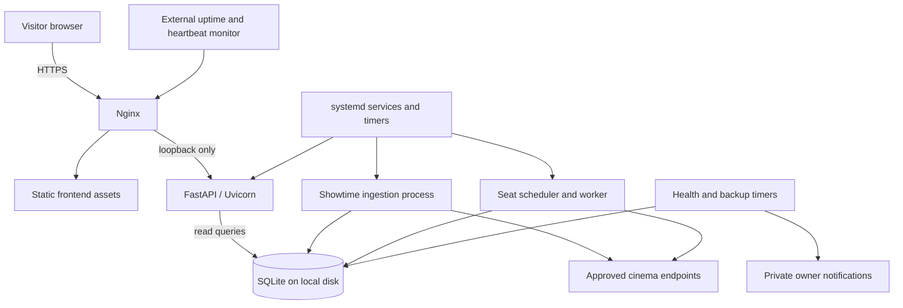

# Warsaw Cinema Aggregator — Server App Roadmap

Updated: 2026-10-01. **Status: automatic seat collection deployed for Kinoteka, all seven configured Cinema City venues, Novekino Wisła, Novekino Atlantic and Amondo (11 venues).**

This is the working plan for a maintainable server application and an L2/support/incident engineering portfolio project. Reliability must be demonstrated through measurements and recovery exercises. Smoke tests establish that sampled requests worked, not production guarantees.

## Resume here

October 1 schedule-change handling (schema 0010_schedule_changes): published accepted
cinema/date scopes reconcile pending seat jobs against exact booking identity/start.
Removed jobs are superseded; existing observations remain. Audit records reference
confirming fetch run/time. Empty, failed, quarantined or invalid-identity scopes do
not cancel jobs. Replacement bookings are new identities, not merged histories.
Cinema City PRESENTATION_NOT_FOUND is screening_missing with bounded provider code
and booking URL diagnostics, not a misleading HTTP-200 upstream error.
Durable deduplicated cinema/date verification requests run off-thread with the regular
refresh flock, provider cooldown and global 15-minute minimum targeted spacing.
Only missing-booking incidents get up to 15 minutes verification grace; accepted
refresh still listing the booking, failed verification, or grace expiry remains
alertable. Confirmed removal resolves as schedule_changed without fictitious seat
recovery. Worker dispatch continues while verification runs. Deployment pending.


October 1 cutoff policy update: routine T0/T+5 removed for Wisła, Atlantic and
Amondo. Historical checks unchanged. Final offsets: Wisła/Amondo T-5 and T-2;
Atlantic T-5 (T-2 not yet validated); Cinema City and Kinoteka unchanged.
Unattempted pending removed windows become superseded; attempted history retained.
Expected post-start availability notices are retired only for the established
provider/outcome combination with successful T-5/T-2 observations of the SAME
screening before showtime. No network, HTTP, validation or pre-start failure is
silenced. Resolution is labelled expected_cutoff, never a fictitious seat recovery.
Health retains these observations and last pre-start counts without open warnings.
Historical technical failures and missed jobs can still produce ATTENTION.
Deployed as 7ad27b3; worker active. Verified zero pending removed T0/T+5 windows;
17 evidenced cutoff alert records resolved. Health displays EXPECTED CUTOFF with
last pre-start counts. Other historical technical failures/misses remain visible.


October 1 18:53 incident review: Novekino showtime unavailability repeats;
Amondo Do utraty tchu returned 20/0/20 at T-2, then listing_absent at T0/T+5.
This establishes disappearance from repertoire, not direct sales closure.
Both Cinema City HTTP 500 incidents recovered (Odyseja via same-window retry;
Resident Evil at later offset). Worker restarted at 17:12:41 after SQLITE_BUSY
while checking journal mode during connection setup, outside BEGIN retries.
Add two bounded setup-check retries, close connections on failed initialization,
and retain all original incident evidence. No cutoff observations are disabled.
Deployed 93e1b09; worker active and installed setup retry/database access verified.
233 tests plus lint/type/source secret checks pass. Lock holder is not identified.
Next: show last successful pre-start counts alongside availability notices and
separate expected cutoff experiments from actionable collector incidents without
hiding evidence or assuming that missing listings prove closed sales.


October 1 Amondo integration: dedicated independently paced provider queue;
read-only repertoire, salesInfo and seat-layout requests. Exact organizer/show/start
matching prevents selecting a different screening. Historical offsets plus T-5,
T-2, T0 and T+5 remain experimental; provider sales stop/status and event ID are
stored in bounded diagnostics. Missing listing is not proof of cutoff or sold out.
No layout-capacity fallback from available-seat count. Existing retries, SQLite,
health and failure/recovery alerts apply. Deployed as c7c8da9; worker active, eight screenings imported, 85 future scheduled jobs verified. Saved production diagnostic: Stop Making Sense at 20:45, 12 available / 8 unavailable / 20 capacity. Direct probe of Do utraty tchu at 17:30: 20/0/20. Same-show links on different dates retain independent jobs.


October 1 transient HTTP retry: HTTP 500/502/503/504 now qualify for the existing
single delayed retry (30 seconds), only for scheduled checks with enough request
budget inside the original deadline. Provider pacing and cooldowns still apply.
Both attempts remain in SQLite; no historical failed jobs are automatically replayed.
Deployed as 7218097; worker active and installed retry policy verified. All 222 tests, lint, type checks and source secret scan passed.


October 1 Cinema City expansion: all seven venues from the legacy page passed fresh
VPS booking probes. Enabled together under the shared chain cooldown and
existing historical/late-check schedule; Sadyba remains IMAX-only.
Early checks now have ten-minute queue slack after a measured 55-job peak; near-start
windows remain two minutes. Refresh timeout now 30 minutes, stuck warning after 25.

October 1: historical observation scheduling deployed for the three enabled venues.
T-24h/-12h/-6h/-3h/-2h/-1h/-30m/-15m/-5m, plus existing Kinoteka/Arkadia late checks.
Wisła's final check is now T-2, with a hard showtime cutoff and T-5 fallback.
No past historical slots are backfilled; review traffic and timing evidence today.

Wisła pilot deployed: October 1 Kura at 10:00 verified 103 available / 17 unavailable /
120 capacity through a saved production diagnostic. All 15 tomorrow screenings have
45 pending T-5/T/T+5 checks; first at 09:55 Warsaw. Refresh includes Wisła from the next
timer run. Missing MSI pages remain technical failures, not confirmed closures.

September 30 evening maintenance: schedule-count validation and refresh alert clarity
corrected; see the latest handover entry. Seven-hour stale warnings concern the last
fully accepted schedule run, not a seven-hour interruption in seat collection.

**Current checkpoint, September 30:** Arkadia now
uses automatic T-5/T/T+5/T+10 seat jobs; Kinoteka retains T-5/T/T+5/T+40. Shared schedule
refresh fetches both venues today/tomorrow. Provider cooldowns are independent; status
and existing Telegram failure/recovery alerts identify the cinema. Other venues remain
disabled. Next: review Arkadia scheduled observations, burst delays and closure timing
before expanding. Both Telegram integrations now use Cinema Alerts; the independent
missed-heartbeat/recovery exercise remains outstanding. Public website unchanged.
Bounded transient retries are also deployed: one retry after 30 seconds, only with
enough time remaining inside the original window. See runbook for exact exclusions,
timing reserves, coverage and recovery semantics.

Encrypted B2 offsite backups are now deployed and scheduled daily at 03:15 UTC
(+ up to two minutes). First upload and cloud restore passed at 17:24:59 Warsaw:
381 observations and 990 jobs preserved, full integrity/schema/foreign keys and hash
verified. A second cloud download was checked on the PC through the actual API.
Retention keeps seven daily/four weekly points; hidden versions expire after one day.
Failure/staleness/storage alerts use existing Telegram monitoring. Recovery credentials
are protected outside Git on the PC as well as the VPS. See
[offsite runbook and restore evidence](docs/offsite-backups.md).
Next: inspect the first unattended overnight backup, complete the independent
missed-heartbeat/recovery exercise, and review Arkadia's full 24-hour pilot before
expanding. The earlier [local restore drill](docs/backup-restore-drill-20260930.md)
remains historical evidence.

Observations are stored in SQLite. See the [seat-pilot runbook](docs/seat-pilot.md);
run `sudo cinema-pilot-status` on the VPS. This remains an isolated pilot, not the
completed server app/public website migration. Historical credential rotation remains
an owner item if live.

| Item | Current position |
|---|---|
| Existing app | Static HTML/CSS/JS; Python adapters generate showtimes JSON |
| Seat research | Experimental probes and recorded cutoff observations |
| VPS | OVH VPS-1, reported 2 vCPU / 4 GB RAM / 40 GB storage; Ubuntu installed |
| VPS evidence | User-reported September 27 smoke results returned counts for 19 sampled cinemas across seven booking platforms |
| Still unproven | Sustained multi-provider load, remaining fresh-session timings, complete host hardening, full replacement-host recovery and independent outage detection |
| Architecture | One VPS, FastAPI, SQLite, separate background processes, Nginx, systemd |
| Current scope | Development API/database/collection plus Kinoteka and Arkadia pilots on the VPS; public site unchanged |

### Storage/provider preparation checkpoint

Local backup rotation and storage reporting are deployed. Managed copies retain seven
daily plus four older weekly copies; manual/legacy backups are protected. New backup
validation precedes pruning. Status selects latest backup by modification time and
shows DB/backup/disk totals, with low-space and backup-budget warnings. No screening
or observation retention/deletion has been enabled. Encrypted offsite backups and a
cloud-download restore are verified; first unattended overnight run is pending.

Cinema City Arkadia is now scheduled. Investigation history: September 29
VPS schedule fetch returned 77 screenings for September 30; the earliest booking
(Marsupilami 09:00, presentation 1717810) returned HTTP 403 at presentation lookup.
The probe stopped. September 30: restored experiment request headers, accepted integer
reservation metadata and corrected sparse seat-status parsing using the public frontend.
Fresh VPS probe succeeded: 74 October 1 screenings; Odyseja 09:30, presentation 1709930,
157 available / 29 unavailable / 186 capacity. Unavailable is not confirmed purchased.
Provider-aware jobs, worker dispatch, refresh and health/alerts are now deployed for
Arkadia. Activation skips earlier check windows instead of manufacturing startup misses.
Next: validate sustained coverage and hall formats before adding other venues.

### Next implementation sessions

1. **Independent outage detection:** Healthchecks free check selected (15-minute period,
   10-minute grace). Sender deployed after completed monitoring work, with 30-day local
   attempt history. Both Telegram integrations are connected to Cinema Alerts.
   Verify missed-heartbeat and recovery notifications without interrupting seat collection.
   Telegram delivery from the VPS cannot report loss of the VPS itself.
2. **First 24-hour pilot review:** save a short evidence report covering schedule refreshes,
   due/successful/missed/late checks, transient failures, recovered incidents, notification
   delivery and overnight backup. Separate the three known startup misses from later misses.
   This review gates provider expansion, not all parallel development.
3. **Bounded transient seat retries — deployed:** one retry after 30 seconds for the first
   scheduled network error/timeout, reserving 20s Kinoteka or 60s Cinema City before the
   original deadline. Both attempts persist; no retry for TLS, other HTTP errors, blocks, invalid
   data, closure or diagnostics. Review real retry outcomes during the pilot.
4. **Broaden collection one provider at a time:** validate fresh schedules, identity, seat
   counts, TLS, browser resource usage and timings on the VPS before enabling each provider.
   Measure bursts before increasing concurrency; keep the legacy site operational.
5. **Finish unattended-operation safeguards alongside expansion:** review exposed ports and
   host security and exercise independent outage detection. Offsite storage/retention and
   cloud restore are implemented; verify the first overnight timer execution and later
   practice replacement-host recovery.
6. **Serve observations through the API, then integrate the frontend:** timestamps and
   freshness/error semantics first; mobile accessibility, usability and privacy-conscious
   visitor analytics remain planned. Public HTTPS and switch-over follow validation.

Current implementation limits: only Kinoteka and Arkadia enabled; external outage testing still pending,
first unattended offsite timer run and full host recovery still unverified. Incident reconstruction
currently scans retained observations; incremental/indexed processing is needed before large
history/multi-provider scale. The 15-minute Telegram timer controls notification latency.

### Keep the existing site operational during development

- Development checkout: this repository folder, branch `codex/server-app`; roadmap/server-app edits remain separate from production.
- Live checkout: `C:/Users/Kacper Szatkowski/.codex/worktrees/cinema-live-maintenance/warsaw-cinema-aggregator`, branch `main`, with its own Python environment. **Do not archive this worktree or switch its branch while the daily refresh task uses it.**
- The existing Windows task retains its registered launcher path because Windows denied changing the task definition. The launcher reads `%LOCALAPPDATA%/WarsawCinemaAggregator/live_checkout.txt` and delegates to the live checkout before loading application code. Preserve this routing behavior when editing development scripts; an administrator can later point the task directly to the live checkout.
- Daily fetching/publishing still uses the original frontend/adapters. Only explicitly reviewed maintenance fixes and generated data go to `main`; the full server-app website is not deployed; only the isolated Kinoteka/Arkadia background pilot runs on the VPS.
- Refresh transcripts: `%LOCALAPPDATA%/WarsawCinemaAggregator/logs`. A successful local push triggers the existing Pages deployment; check that deployment separately.

After each implementation session, update the phase status and handover log: completed work, exact commit, checks performed, remaining issue, and next small step. Record local and VPS status separately. Code existing is not enough to mark a phase complete.

## 1. Engineering review: corrections to the original plan

These are requirements for implementation, not capabilities already present.

| Priority | Finding in the current project | Required correction |
|---|---|---|
| Before release | Initial review found an API-key-shaped TMDB credential in tracked configuration; removed from development source, but retained in Git history | Revoke/rotate if live; environment configuration and current-source secret scanning are implemented |
| Before unattended collection | Missing maps/handshakes, expired sessions and some generic API failures become `closed` in the monitor | Separate technical failure from confirmed sales closure; failure never becomes zero seats |
| Before selecting timings | Wisła failed as early as T+2; Kultura has no observed open-to-closed transition | Replace the previous “T+3 is conservative” and “T-20 is safe” assumptions |
| Before selecting timings | MSI experiments reuse a client/session and cached booking URLs | Validate opening a fresh session at the intended production time |
| Before public seat features | One late observation occurs near or after showtime | First release offers timestamped snapshots; live pre-show availability needs another collection policy |
| Before ingestion | Failed fetches can look like empty schedules; one failing date can discard other successful dates | Typed per-cinema/per-date outcomes; preserve last successful data |
| Before scheduling | Long showtime refreshes and simultaneous seat jobs compete for time | Separate processes, shared provider budgets, durable jobs and measured capacity |
| Before public exposure | `app.js` interpolates external values into HTML; Kultura research disables TLS validation | Safe DOM/URL handling; validated HTTPS for production collectors |
| From the first backend phase | Monitoring and logs were mostly left until the end | Build structured logs, health semantics and failure categories early |
| Before launch | Restart settings and backup commands do not prove recovery | Demonstrate restore, restart and release rollback; test external monitoring |

Local evidence: [build](src/cinema_agg/build.py), [monitor](scripts/monitor_booking_cutoffs.py), [selector](scripts/select_cutoff_targets.py), [seat parser](src/cinema_agg/seat_availability.py), [frontend](app.js), [workflows](.github/workflows), [cutoff summary](outputs/seat-cutoff/cutoff-summary-combined-2026-09-27.txt). Preserve a sanitized evidence summary in Git in Phase 0; raw experiment files are currently local and may not exist in a fresh clone.

## 2. Product scope and truthful data

First release:

- Continuously hosted, mobile-friendly showtime website and read-only API.
- Durable scheduled collection with useful data retained when a cinema fails.
- Seat checks at T-5, T and T+5 plus the evidence-based provider offset; deduplicate coincident checks and bound retries/provider traffic. Revisit the number of checks only after reviewing repeatability.
- Private operational report, actionable alerts and documented recovery.
- Public timestamps and clear unknown/stale states.

**Unavailable seats are not verified purchases or attendance.** They can include temporary reservations, blocked seats and capacity restrictions. Call derived percentages “observed seat unavailability.” Do not label them tickets sold, revenue or attendance.

Store these independently:

| Concept | Values / meaning |
|---|---|
| Observation outcome | success, timeout, network_error, upstream_error, tls_error, blocked, parse_error, invalid_data, unsupported |
| Sales state | open, confirmed_closed, unknown; only what the source establishes |
| Counts | available, capacity, unavailable; nullable when unknown |
| Freshness | observed_at, last_success_at, stale |
| Schedule state | upcoming, started, removed/cancelled; start time alone does not prove closure |

A generic 403/404, expired session, missing selector or changed JSON shape is not sufficient proof of closed sales. Use explicit, tested provider closure evidence. Zero available means “no seats available at last check,” not a permanent sold-out guarantee. Unknown remains null, never zero.

### Live website versus live collection

The API exposes committed database updates without rebuilding the website. The browser can refresh our API every 60 seconds while visible and stop polling when hidden; this creates no cinema traffic.

But a late snapshot cannot tell a visitor at 14:00 how many seats remain for 20:00. Most first-release seat data will be retrospective. “Available now,” “only bookable now” and early sold-out detection require a separate pre-show refresh/freshness policy and request budget. Keep booking links usable when our seat data is absent, stale or failed.

## 3. Architecture and selected tools



One repository and deployable application with separate process responsibilities; this is not a microservices project.

| Component | Decision and reason |
|---|---|
| OS | Keep installed supported Ubuntu LTS; verify exact release and update status |
| API | FastAPI + Pydantic; one Uvicorn process initially |
| Database | SQLite; SQLAlchemy 2 for access and Alembic for reviewed schema migrations |
| Seat jobs | Durable SQLite job table; one scheduler/worker service with bounded execution slots |
| Showtime refresh | Separate process invoked by systemd timer; one refresh at a time |
| Browser | Packaged, pinned Chromium tooling; prefer Playwright for explicit waits/cleanup after validating migration of existing probes |
| Frontend | Existing vanilla JS/CSS, improved structure and accessibility |
| Public entry | Nginx serves frontend and `/api/v1/*` on the same HTTPS origin |
| Operations | Python JSON logs to journald, private health report, one alert channel and independent external monitoring |
| Quality | pytest, Ruff, type checks for new backend code, dependency/secret checks in GitHub Actions |
| Packaging | Python 3.13 primary / 3.12 supported; uv 0.12.19 lock and Hatchling wheel; optional curl_cffi transport is explicit |

The proposed browser-tool migration is not proven by the current smoke test. Validate counts, memory and sandbox compatibility before adopting it. API requests read stored data only; they never scrape or launch jobs. Keep blocking DB/browser operations out of an async event loop: synchronous FastAPI handlers suit synchronous DB queries; browser work needs a bounded executor/process boundary.

HTTPS, startup, restart and memory management are explicit deployment concerns. systemd supervises processes; additional API workers are justified by measurements, not added automatically. [FastAPI deployment concepts](https://fastapi.tiangolo.com/deployment/concepts/)

### Capacity and cost

Use the existing VPS before considering upgrades. Start with one browser check at a time and up to two lightweight HTTP seat jobs, still limited per provider. Reserve capacity for Linux, Nginx, API and ingestion. Measure peak memory, CPU, job duration and queue delay before changing concurrency.

No required paid database, Redis, Celery, Kubernetes, ELK or Grafana installation. No automatic VPS upgrade. A domain and independent backup storage may cost extra; verify actual prices/quotas when selecting them. Budget against the existing invoice, not an assumed promotional VPS price. Sentry can be added later for grouped exceptions, but does not replace dead-worker or server-outage detection.

SQLite remains appropriate while brief writes on one host meet latency/locking goals. Consider PostgreSQL if write contention persists after transaction tuning or multiple application hosts become necessary. Such a move needs a tested migration, not just a connection-string change.

## 4. Collection policy and cutoff evidence

T is the advertised start, interpreted in `Europe/Warsaw`. These are small historical samples, not chain-wide guarantees. Keep policy versions, sample dates, venue scope and evidence confidence.

**Updated user requirement (September 28):** for each eligible screening, plan
checks at **T-5 minutes, T, and T+5 minutes**, plus the provider-specific timing
below. This is relative to the advertised start, not the film's end. Deduplicate
identical offsets (one observation serves both purposes); nearby but different
offsets are not automatically equivalent. Usually this means four observations,
not the previously proposed single check. Save actual observation time/offset,
event identity and outcomes to investigate cutoff variability. A failure never
establishes closure or zero seats. Blocked/rate-limited endpoints still require
cooldown; report skipped or late checks instead of bypassing provider limits.
**Now running for Kinoteka only.** Its additional evidence-timed check is T+40.
Other providers still need validated implementations before enablement.

| Venue/platform | Actual evidence | Provisional completion target for fresh-session validation |
|---|---|---|
| Atlantic / MSI | Readable around T-2; missing handshake T-1 in three samples | T-4; confirm fresh entry and closure classification |
| Wisła / MSI | First failures T+2, T+4, T+10; other samples readable through T+45 | T-2 initially; T+3 was not conservative |
| Kultura / MSI | Missing handshake at first T-15 probe in four runs; no preceding success in those runs | T-30 is an experiment candidate only, not an established safe rule |
| Multikino | Readable around T+14, missing map T+15 in several venues | T+10; disappearance is weaker evidence than explicit closure |
| Cinema City | Corrected September 17 API sample readable T+14; explicit TICKETING_ENDED at T+15 | T+10; verify more venues |
| Helios | Readable T+29, missing map T+30 in two samples | T+25; confirm fresh sessions |
| Bilety24 / Elektronik | Readable T-1, missing map at T in one sample | T-3; do not automatically generalize to Luna |
| Kinoteka | Counts still returned T+45; closure not measured | T+40 for a late snapshot; verify count freshness |
| Amondo / Biletomat | Corrected September 21 flow returns counts through T+45 | T+40; verify identity and count freshness |

Earlier Cinema City rendered-page failures and pre-fix Amondo failures are invalid cutoff evidence. Preserve them as debugging history. Kinoteka/Amondo T+45 is the observation horizon, not a sales deadline. Kultura must have valid TLS before production eligibility; research exceptions are not inherited.

These targets intentionally leave more execution margin than the earlier recommendations, but remain proposed. Dispatch before the completion target using measured runtime/queue allowance. Define `not_before`, desired completion and `deadline_at` before enabling each policy. Deadlines are operational limits, not public claims about cinema sales rules.

### Provider enablement gate

1. Inventory every configured cinema: showtime adapter, seat capability, approved hosts, TLS, evidence and limitations. Unsupported cinemas remain in showtimes and coverage reports.
2. Test a fresh session at the candidate time for at least three screenings on at least two days, with venue-specific checks where behavior differs. This is a launch sample, not statistical proof.
3. Compare event identity, hall and counts with a manual view. Include no-availability and technical-failure fixtures.
4. Confirm the flow never selects/holds seats or submits orders. An MSI hidden-form handshake can use POST; method alone does not establish whether an action is safe.
5. Measure actual request count and duration. One observation may require several HTTP requests and many browser assets.
6. Replay the busiest known cluster offline with measured durations, then run a bounded live pilot.

Failure disables only the affected seat capability. Do not silently remove its cinema or improve coverage percentages by excluding errors.

### Traffic limits

- Initial proposal: full 14-day showtime refresh daily; today/tomorrow every four hours. Tune per provider after measuring duration and publication patterns. A slow full refresh must not delay seat work.
- Bound traffic by provider/host, not merely cinema. Ingestion and seat processes share request budgets; defer lower-priority refresh work when seat deadlines need the allowance.
- Retain cautious Multikino pacing initially. Cache static metadata/seat plans only with identity/version validation.
- Limit redirects, response sizes, per-request timeouts and total job duration. Respect Retry-After and upstream restrictions. Repeated access denial causes a cooldown, not escalating requests or rotating identities.
- Current pilot: at most one additional attempt for network errors/timeouts and HTTP 500/502/503/504, after 30s and only when delay plus expected duration fits the original window. No automatic retries for TLS, other HTTP errors (including 404/429/501), malformed data or confirmed closure. Broader retry classes require separate provider evidence and review; respect provider cooldowns.
- Persist provider cooldowns. Permit one controlled recovery probe, not one probe from every queued screening.

## 5. Data model and integrity

Use committed Alembic migrations, reviewed before execution; no schema mutation in API startup/requests. Use constraints and indexes as well as application validation. [SQLAlchemy SQLite guidance](https://docs.sqlalchemy.org/en/20/dialects/sqlite.html), [Alembic migrations](https://alembic.sqlalchemy.org/en/latest/tutorial.html)

| Table | Core fields / purpose |
|---|---|
| cinemas | Stable ID, adapter, timezone, seat capability, enabled state; support separate from health |
| screenings | Stable ID, cinema/provider event/hall identity, title, start UTC, booking URL, first/last seen, schedule revision/status |
| fetch_runs | Run ID, release, start/end, requested scope, overall success/partial/failure |
| fetch_results | Per run/cinema/date outcome, counts, duration, reason and sanitized diagnostic reference |
| seat_check_jobs | Unique job key, screening revision, purpose/policy, not-before/target/deadline, next attempt, state, lease token/expiry |
| seat_checks | Append-only attempts: job/attempt ID, start/end/observation time, outcome, sales state, nullable counts, identity/capacity source, session mode, adapter/release |
| cinema_health | Rebuildable showtime/seat health summary, freshness and streaks |
| service_heartbeats | Service instance, progress/heartbeat time, release and last completed task |
| alert_state | Fingerprint, open/resolved state, first/last seen, last notification, bounded suppression |

Invariants to implement in Phase 2:

- Prefer `(provider, cinema_id, provider_event_id)` uniqueness when valid for that provider. Document ID reuse and fallback identity including hall/start/source; do not merge simultaneous halls by movie title/time alone. Strip session/tracking tokens from identities.
- A reschedule keeps source identity where possible, increments schedule revision and replans pending work. History records the start time actually checked.
- Store UTC instants in one enforced representation, e.g. Unix milliseconds; use aware datetimes at boundaries. Interpret local sources with `ZoneInfo('Europe/Warsaw')`. Do not strip offsets or rely on server timezone. Test DST, midnight and ambiguous local times.
- Counts must be nonnegative integers; available cannot exceed capacity. Derive unavailable only for a common seat universe. Reject unknown seat status values, duplicated seats and unidentified halls.
- Verify/version Atlantic's hardcoded capacities. Unknown capacity stays null. Amondo must not substitute available for total capacity or select an arbitrarily distant nearest event. Reject ambiguous/wrong event identity.
- A failed attempt never replaces the latest valid observation. Return the earlier observation with its timestamp and latest attempt outcome.
- Index cinema/start, source identity, job state/next-attempt/deadline and screening/observation time. Bound reads and avoid per-screening queries.

### Partial failures

Validate and commit each cinema/date scope atomically. Distinguish a successful empty schedule from an error/parser failure. Keep last good rows when a scope fails and label them stale; do not advance last-success timestamps after a failed/partial parse.

Retire missing screenings only after a complete trustworthy refresh of their scope. Quarantine suspicious count collapses for confirmation instead of mass-cancelling bookings. Other cinemas/dates can still update.

### SQLite operation

Use local disk, WAL, short transactions, per-connection foreign keys and a bounded busy timeout. Network calls occur outside transactions. WAL still allows only one writer at a time. Test lock handling, WAL growth and API read-only permissions across restarts; do not use `immutable=1` for changing data. [SQLite WAL documentation](https://sqlite.org/wal.html)

Verify the SQLite library actually linked into Python and its distribution patch status before enabling WAL. SQLite documents a rare WAL-reset corruption fix in 3.51.3, with earlier backports including 3.44.6 and 3.50.7. Use a fixed release or confirmed vendor backport; a Python dependency lock does not prove this. [SQLite WAL-reset advisory](https://sqlite.org/wal.html#walreset)

## 6. Durable jobs and restart behavior

Processes: `cinema-api.service`, `cinema-seat-worker.service`, timer-triggered `cinema-fetch.service`, plus independent health/backup timers. A long refresh never blocks the seat scheduler.

Job states: pending, running, retry_wait, succeeded, failed, expired, cancelled. Explicit closure is a successful observation of sales state, but not a usable seat-count snapshot.

- One logical job per screening revision/purpose/policy. Policy changes cancel obsolete pending work to avoid collecting twice.
- Atomically claim with a unique lease token; renew only during progress. Commit results only while that token/revision owns the claim.
- Commit observation/attempt and job transition together. Execution is at-least-once: a crash after a request but before saving can cause a bounded repeat. Do not promise exactly one upstream call; database effects must be idempotent.
- Recover expired claims on startup. Run overdue jobs only if they still fit the window; mark other jobs missed/expired rather than replaying a historical backlog.
- Prioritize earliest deadlines; wake promptly (initially at most every five seconds). Measure scheduler delay. Do not depend on a minute loop when the timing margin is one minute.
- Budget session setup, rate-limit waiting, rendering and parsing together. Record actual start/end and observed offset from showtime.
- Drain briefly on shutdown, terminate owned browser children, retain recoverable job state and clean profiles in a dedicated cache directory, including after crashes.
- Owner-only CLI: inspect/pause/retry by job/provider. Audit manual actions and reasons. After-deadline diagnostics are separate jobs, not rewritten history.

## 7. Security baseline

Relevant risks: exposed management ports, malicious upstream data/URLs, third-party browser code, resource exhaustion, credentials in source/logs and unsafe deployments.

### Host and access

- Use SSH keys and retain OVH console recovery. Test a second authenticated session before disabling password login; keep the first session open until verified. Disable direct root login; use MFA on hosting/GitHub accounts where available. [Ubuntu SSH guidance](https://ubuntu.com/server/docs/how-to/security/openssh-server/)
- Permit only intended inbound SSH/HTTP/HTTPS traffic, including IPv6. Keep Uvicorn and browser debugging private.
- Dedicated unprivileged service users; code read-only to runtime identities; writable state/cache only. Separate API database access from worker writes and test WAL sidecar permissions.
- Apply OS/browser updates and plan reboots. Use measured systemd resource/restart limits and tested privilege/filesystem restrictions. Do not fix sandbox conflicts by running Chromium as root or disabling its sandbox.
- Protected runtime secrets outside Git/document root, with placeholder examples. Confirm/rotate the source-embedded key if live; removing it from the latest commit alone does not invalidate it.

### HTTP and untrusted data

- HTTPS with tested renewal and expiry alerts before launch. Same-origin frontend/API; trust forwarding headers only from the local proxy, not arbitrary clients. [FastAPI proxy configuration](https://fastapi.tiangolo.com/advanced/behind-a-proxy/)
- Nginx serves a dedicated asset directory, never the repository root. Database/WAL, config, `.git`, backups, profiles and diagnostic captures remain private.
- Parameterized queries; validated filters/IDs/dates; bounded ranges and pagination (initially max 200 rows/page); request/time limits and tested rate limiting.
- Treat scraped titles, metadata and URLs as untrusted. Use textContent/safe DOM APIs, validated schemes/hosts, event listeners instead of inline handlers, safe external links and a tested Content Security Policy. JSON does not make innerHTML safe.
- Public errors expose stable codes/request IDs, not tracebacks, upstream bodies or secrets. Public requests never trigger collection.

### Collectors

- TLS verification remains enabled in production. Kultura's authorized local experiment exception must be opt-in and confined to research; production reports tls_error/unknown until valid HTTPS works.
- Allow only configured provider schemes/hosts/ports. Check redirects and resolved destinations; reject private, loopback, link-local and metadata addresses for IPv4/IPv6, including browser traffic. Account for DNS changes. No public arbitrary-URL fetch endpoint. [OWASP SSRF guidance](https://cheatsheetseries.owasp.org/cheatsheets/Server_Side_Request_Forgery_Prevention_Cheat_Sheet.html)
- Chromium runs non-root with sandbox enabled, a disposable profile and no public debug port. Inventory necessary provider/CDN domains. Browser processes must not inherit operator secrets or access protected application credentials. Enforce this with a separate restricted runtime identity/filesystem boundary (or equivalent tested isolation); a clean environment/profile alone does not prevent access to files readable by the worker user.
- Never hold/select seats, reserve tickets or submit checkout. Preserve aggregate counts/source IDs, not purchaser data.

Initial administration is SSH/CLI. A future web admin interface needs authentication, authorization, CSRF/session protection and auditing before exposure.

## 8. Logs, health and actionable alerts

### Structured events from the start

One JSON event per line to stdout, captured by persistent, size-limited journald. Include UTC time, severity, event name, service, release, relevant request/run/job/attempt IDs, cinema/provider, duration, outcome and reason. Emit start/progress/end events to distinguish slow work from a hang.

Illustrative event, not an actual incident:

```json
{"timestamp":"2026-09-27T17:02:11Z","level":"warning","service":"seat-worker","event":"seat_check_failed","release":"example-sha","job_id":"example-job","cinema_id":"kultura","attempt":1,"duration_ms":481,"reason":"tls_error","retryable":false}
```

Scrub passwords, keys, cookies, tokens, headers, raw forms and sensitive URL parameters. Bound/escape external text to prevent log injection. Tracebacks and optional captures stay private, scrubbed and expire. [OWASP logging guidance](https://cheatsheetseries.owasp.org/cheatsheets/Logging_Cheat_Sheet.html)

### Different health signals

| Check | Meaning |
|---|---|
| GET /health/live | API process responds; no external work |
| GET /health/ready | DB/schema readable; 503 when API cannot serve its contract; safe summary only |
| GET /api/v1/status | Public data freshness/degraded summary; one failed cinema does not make all API reads unavailable |
| Private report | Service progress, queue/deadlines, counts/errors, backup age, resources and release |
| External monitor | HTTPS/readiness and scheduled-work heartbeat checked outside this VPS |

An active process is not proof of progress. Send task-success heartbeats only after successful work and track a separate worker heartbeat when idle. Local monitoring alone cannot report total VPS failure.

Initial thresholds are configuration proposals; tune against a seven-day baseline:

| Signal | Initial trigger / purpose |
|---|---|
| HTTPS outage | External check fails for about five minutes; outage and recovery notification |
| API errors/latency | Request rate, 5xx, p95 latency; investigate >5% 5xx/5 min with at least 20 requests |
| Worker heartbeat | Absent >2 minutes even when no jobs are due |
| Missed deadlines | Report every miss; alert on clusters/repeated provider misses |
| Showtime freshness | No complete good current-day refresh >6 hours with a four-hour cadence |
| Count anomaly | Example >50% drop and >=10 fewer for a comparable cinema/date/horizon; confirm before retiring data |
| Provider failures | Three consecutive technical failures or sustained failure rate; classify TLS/blocked/parse/network separately |
| Host/DB pressure | Low disk (<20%, critical <10%), OOM, restart loops, repeated locks, abnormal WAL growth |
| Backups | Local copy >26 hours old; failed transfer; independent copy outside recovery objective |
| Certificates/notifications | Expiry <14 days; failed alert delivery; missed external work heartbeat |

Publication cycles and legitimate empty days affect counts. Compare matching scopes/publication stages and track parser yield/partial results alongside totals.

Measure usable snapshots / eligible supported screenings AND supported screenings / all screenings. Also report unsupported, disabled, discovered-too-late and expired jobs. Failures must not disappear from denominators. Track request counts, scheduler delay and p95 duration per platform.

Persist deduplicated alert state; group platform incidents, send recovery notices, allow bounded maintenance suppression. Each alert includes impact, first seen, last success, release, safe evidence and a runbook. Failed notification delivery must be visible. Choose one owner-controlled email/webhook channel and an external uptime/heartbeat service; verify current quotas at setup. A paid logging subscription is not required by this design.

### Objectives, not guarantees

After baseline measurement, provisional objectives are 99.5% monthly public availability and p95 API response <500 ms under documented modest load (initial test: five requests/second while workers run). Set seat coverage objectives from pilot results; report scheduler reliability separately from upstream availability.

These are operating targets, not an SLA. One VPS is a single point of failure. Report actual data and sample sizes; monitoring does not create high availability.

## 9. Backups, retention, releases and incidents

### Recovery

- Daily consistent SQLite backup and pre-migration backup using the supported backup API/command. Do not copy only a live .db file and ignore WAL. Validate backups before retaining/transferring. [SQLite online backup](https://www.sqlite.org/backup.html)
- Initially seven daily/four weekly backups within a measured storage budget. Keep an encrypted independent copy off the VPS with restricted access. OVH automatic backup is an extra layer; confirm its retention and restore procedure.
- Provisional RPO: at most 24 hours lost historical data. Attended RTO: restore within two hours after the operator begins recovery with a replacement host available. These depend on daily independent backups; document weaker objectives if the chosen destination cannot meet them.
- Restore to an isolated DB/environment; verify integrity, foreign keys, known counts and API reads. Rehearse before launch and after material schema/storage changes. Never drill by overwriting the live DB.
- Seat history cannot simply be fetched again after screenings pass. Retain matching migration/config versions and document secure credential recovery separately.

Initial retention: logs 14 days with a size cap (start around 500 MB); debug captures 72 hours; detailed fetch/job diagnostics 90 days; seat observations/required screening metadata 12 months, then review aggregation/archive. Measure growth, preserve minimal deduplication identities, and review access-log IP retention/privacy before adding visitor analytics. Page views are not unique people.

### Releases

GitHub Actions tests/builds code; VPS jobs collect cinema data. Deploy a tested commit/tag into a clean release directory/virtualenv with locked dependencies, protected config and separate data.

Sequence: CI green -> record release/config -> pause/drain all affected database writers -> take and verify the definitive pre-migration backup -> reviewed compatible migration -> switch release -> restart -> API/worker/job smoke checks -> record outcome. Keep prior release. Code rollback requires schema compatibility; otherwise use reviewed forward-fix/restore. Never blindly downgrade the live DB. Any restoration must explicitly account for observations written after the backup; an older snapshot is not a lossless rollback.

Manual SSH deployment with a documented script is adequate initially. CI needs minimal permissions, reviewed/pinned actions, no production secrets for PRs and a deployment concurrency guard. Add dependency/secret scanning and document exceptions. Offline fixtures drive CI; live cinema tests are deliberate bounded smokes.

The current Pages workflow checks cinema health after deployment. Separate upstream degradation from release verification: a stale cinema should trigger a data incident; code validation happens before deployment and a smoke check after it.

### Runbooks and interview evidence

Write short runbooks for missing data, TLS failure, 403/challenge, parser change, stuck worker/missed deadline, DB lock/disk full, certificate renewal, backup/restore, release rollback and SSH recovery.

Each: symptom/impact -> read-only evidence -> likely causes -> safe mitigation -> validation -> recovery/escalation -> prevention. Collect timeframe/release/run/job IDs before restarting when practical. Provide CLI/table output so diagnosis does not require reading huge JSON files.

Incident notes include detection/acknowledgement/recovery times, impact, timeline, contributing factors, resolution and prevention tasks. Practise a simulated incident and restore drill, explicitly labelled as exercises. Calculate MTTD/MTTR only from recorded events with definitions/sample sizes; do not claim drills are production incidents.

## 10. API and mobile contract

Initial endpoints:

- GET /api/v1/cinemas
- GET /api/v1/dates
- GET /api/v1/screenings?date=YYYY-MM-DD&cinema_id=...&limit=...&cursor=...
- GET /api/v1/screenings/{id}
- GET /api/v1/status
- Health endpoints above; historical statistics follow after metric definitions are verified.

Return latest valid observation, its time, latest attempt outcome and freshness with each screening. Typed responses, deterministic pagination, UTC timestamps with offsets, request IDs and documented errors. Add data version/generated_at and ETag or short cache lifetime (initially 30–60 seconds). Private diagnostics are never publicly cached.

Frontend: distinguish loading, empty, error and stale cached data; retain usable last-known data with age during refresh failure. Handle pagination and midnight changes. “Started” comes from time; “confirmed closed” requires evidence. A failed seat check never disables a booking link.

Mobile gate: usable at 360/390 px widths without unintended horizontal scrolling; touch targets around 44 px; visible keyboard focus, readable contrast and meaningful text alongside colors. Compact movie cards, cinema rows and showtime buttons. Test long Polish titles, many venues and absent posters. Bottom-sheet filters are optional.

## 11. Implementation phases and completion gates

Phase 0 code/checks are complete with owner credential rotation confirmation pending. Phases 1–5 are **in progress**, with the first Phase 6 read endpoint implemented early. The isolated Kinoteka pilot covers part of Phases 4–5; full provider coverage and load validation remain outstanding. Phases 7–9 are not complete; pilot service and local backup setup provide only an initial subset. Follow these delivery milestones; the technical phases below support them rather than requiring every infrastructure component first.

### Delivery milestones (follow these when resuming)

1. **Fresh screenings → DB → API:** working local pilot; broaden provider validation and improve completeness/error reporting before automatic refresh.
2. **Seat observations → DB → API:** Kinoteka worker now runs on the VPS using provider event/cinema identity plus start-time revision. SQL/CSV inspection is available; public seat API and other providers remain to be implemented/validated.
3. **Unattended VPS operation:** finish host security, backup/restore, scheduling, restart/recovery and alerts; prove continuous operation.
4. **Website integration and usability:** API-backed frontend, mobile accessibility, freshness indicators and privacy-conscious visitor analytics.

### Phase 0 — Repository and baseline

- [x] Review tracked/untracked files; preserve user edits/evidence. Ignore secrets, DB/WAL, logs, raw captures and profiles. Audit broad *.json/*.js ignores so intended fixtures are not lost.
- [ ] Owner: confirm historical source credential revocation/rotation if live.
- [x] Package existing src/cinema_agg with pyproject.toml; support Python 3.12/3.13 and lock runtime/dev dependencies. Pin production browser tooling when migrating providers in Phase 4; existing research still uses external Chrome.
- [x] Add offline tests, scoped correctness lint and source-secret/runtime-dependency checks in CI; document the existing baseline. All four hosted jobs passed for commit `600d148` ([run](https://github.com/kszat99/warsaw-cinema-aggregator/actions/runs/36439248607)).
- [x] Write README, config example and sanitized provider/evidence summary; include research code in the development commit for fresh clones.

**Done:** a fresh environment installs/tests from documented commands; exact local/VPS code versions are identifiable. Save commit/CI/install evidence.

### Phase 1 — Secure host and observable skeleton

- [ ] Verify OS/Python/SQLite/Chromium, clock sync, updates, recovery and IPv4/IPv6 exposure.
- [ ] Establish tested SSH keys, unprivileged identities, private config/state and measured service limits.
- [x] Add validated config, FastAPI liveness and JSON logs/request IDs locally; 33 offline tests pass, strict backend types/lint pass, real localhost HTTP and clean wheel smoke pass.
- [ ] Add separate worker heartbeat/shutdown skeleton. No collectors run inside the API.
- [ ] Run systemd services on loopback; verify reboot/restart behavior and browser sandbox compatibility.

**Done:** no open terminal/root runtime required; config failures are actionable, logs searchable/redacted, restart demonstrated. Save sanitized service/port/restart results.

### Phase 2 — Database and restoration

Completed local subset: immutable `imports`/`screenings` snapshot tables, explicit
Alembic migration, atomic validated import, UTC milliseconds, query indexes,
read-only API connections and schema readiness. These snapshot-scoped row IDs are
not yet stable provider identities; do not schedule seat jobs against them.
Windows SQLite is 3.49.1 with unverified WAL patch status, so this slice deliberately
uses DELETE journal mode. Full phase completion below remains open.

- [ ] Implement schema/identity/time invariants, indexes, migrations, read-only API access and lock handling.
- [ ] Verify patched linked SQLite before WAL; add schema readiness checks.
- [ ] Build consistent backup/isolated restore tooling; choose independent storage and record cost/recovery limits.
- [ ] Test initialization, migration, duplicate identity, concurrent reads/writes and restore integrity.

**Done:** backup restores with expected data and API reads; migration and schema-compatible rollback procedures documented. Save restore/migration proof.

### Phase 3 — Reliable showtime ingestion

Local subset implemented: sequential legacy-adapter bridge; cinema/date run results;
empty/error/count-drop retention; API reports latest run and scope outcomes. Only a
Kinoteka one-day live pilot is verified so far. `accepted` means nonempty, validated,
scope-matching output that passed a count check, not proof of parser completeness.
Snapshot replacement does not establish cancellation of absent screenings; stronger
provider-specific completeness and long-running validation remain required.

- [ ] Typed per-scope results; distinguish empty/partial/failed/blocked, retain last-good data, quarantine suspicious drops.
- [ ] Persist run/results/health; normalize identity/time and reconcile changed/removed screenings.
- [ ] Implement timer-driven refresh, bounded provider budgets and optional transition JSON export.
- [ ] Add operator count/freshness/error report and first real failure/recovery alert.

**Done:** one failing provider/date cannot erase good data; diagnosis is possible by run ID. Save failure-fixture tests and a bounded VPS smoke.

### Phase 4 — Production seat adapters and validation

- [ ] Extract shared seat providers from experimental scripts; diagnostics use the same parsers.
- [ ] Correct closure/errors, Amondo matching, capacities, TLS/URL safety and browser cleanup.
- [ ] Add fixtures per platform: counts/no availability/explicit closure, challenge/403, schema change, wrong event, unknown status and timeout.
- [ ] Perform Section 4 fresh-session validation; version timing policies and capability inventory.

**Done:** each enabled provider has identity/count evidence, valid TLS, failure tests and a validated timing window. Others remain explicitly unsupported/degraded until resolved. Save provider matrix/evidence.

### Phase 5 — Durable jobs and load pilot

- [ ] Plan/reconcile unique jobs; atomic claims, leases, deadlines and attempts.
- [ ] Bounded concurrency, shared provider pacing, retries/cooldowns, draining and missed-window reporting.
- [ ] Test crashes after claim/request/before commit; stale completion, duplicates, restart, reschedule during execution and expiry.
- [ ] Offline burst replay then small live pilot; measure memory, actual requests, duration, lateness and coverage.

**Done:** recovery preserves state, expired jobs do not replay, and measured demand fits windows. Adjust dispatch earlier before raising concurrency. Save replay/pilot report.

### Phase 6 — API and operational visibility

Operator-view correction: status and health commands now share one report with
warning reasons first, all affected jobs/failed attempts with timestamps and IDs,
then recent results and upcoming checks. No warning evidence is hidden by the
recent-results limit. Startup causes are not inferred from absent attempts.

Implemented pilot subset: `sudo cinema-pilot-health` produces a read-only rolling
health report (text/JSON), covering refresh counts/freshness, worker heartbeat,
scheduled observation coverage/errors/delay and local backup checks. Startup misses
remain explicit. Telegram is configured on the VPS with durable delivery retries,
deduplication and screening-specific recovery. Next: independent external heartbeat
monitoring, followed by a controlled outage/recovery exercise.

- [ ] Versioned contracts, pagination/caching, safe status and private reports.
- [x] Pilot health report and Telegram delivery: pending/open/resolved states, retries, sanitized delivery errors and recurrence handling.
- [x] Seat incident recovery requires a later successful scheduled check for the same cinema/event/start time; retain historical failures and combine failure/recovery notifications when appropriate.
- [ ] Configure/test an independent heartbeat monitor for VPS/evaluator outages; prepare public HTTPS checks for Phase 8 without exposing Uvicorn.
- [ ] Test DB outage, upstream outage, stale data and concurrent load; test notification and recovery delivery.

**Done:** API never causes cinema calls, failures remain distinguishable, owner can diagnose one cinema from report/log IDs. Save contract/load/alert proof.

### Phase 7 — Mobile and frontend integration

- [ ] API loading/pagination, resilient visible-tab refresh and timestamps.
- [ ] Safe DOM/URL handling, accessible responsive layout and clear started/unknown/stale/closed states.
- [ ] Snapshot labels and useful date/cinema/hide-started filters; defer unsupported “bookable now” claims.
- [ ] Test phone/desktop/keyboard, long titles, missing data and hostile title/URL fixtures.

**Done:** main journeys work; technical failures never falsely close sales; external content renders safely. Save screenshots/browser results.

### Phase 8 — HTTPS and repeatable publication

- [ ] Same-origin Nginx/TLS/renewal, asset-only web root, proxy trust, limits and security headers.
- [ ] Tested release/migration/backup deployment; verify intended public ports including IPv6.
- [ ] Demonstrate rollback, renewal and reboot. Activate the external public HTTPS/readiness monitor and test outage/recovery notifications against the real published endpoint.
- [ ] Switch public site after validation; retire competing PC/GitHub collectors, retaining an explicit static fallback if useful.

**Done:** real HTTPS URL works, sensitive files are inaccessible and rollback is documented/tested. Save release/exposure/recovery evidence.

### Phase 9 — Reliability pilot and portfolio

- [ ] Observe at least seven days including a busy evening; assess queue delay, coverage, freshness, growth and alert noise. Monthly availability claims need longer observation.
- [ ] Controlled worker-failure exercise and isolated restore; record detection/mitigation/recovery.
- [ ] Complete runbooks, architecture decisions, sanitized operator demo, limitations and measured cost.
- [ ] Tune policies using evidence and prioritize follow-up from incidents.

**Done:** another person can follow setup, understand tradeoffs, diagnose an example and reproduce recovery. Link measurements/runbooks/labelled drills.

## 12. Planned layout and future scope

Extend the existing package; these are proposed paths, not existing commands:

```text
src/cinema_agg/
  adapters/                 # existing showtime providers
  seats/                    # shared production seat providers
  api/                      # read-only routes and contracts
  db/                       # models, sessions and queries
  jobs/                     # planning, claiming, execution
  observability/            # logs, health, alerts
  config.py
  cli.py                    # inspect, fetch, pause, diagnose
migrations/                 # reviewed Alembic revisions
deploy/                     # systemd, Nginx, deploy/backup scripts
tests/fixtures/             # small sanitized provider examples
docs/decisions/             # reasons and tradeoffs
docs/runbooks/
docs/incidents/             # real incidents and labelled exercises
```

Runtime data: /var/lib/warsaw-cinema; protected config: /etc/warsaw-cinema; disposable profiles in a service-owned cache directory. Releases/assets outside writable state; permissions verified in Phases 1–2.

For interviews, demonstrate Linux/networking, TLS/proxy diagnosis, SQL/data integrity, job recovery, secure releases and incident communication. A useful story is: detect a provider change, trace it with correlated logs, contain impact, recover and add a regression fixture. Claims must match evidence.

Later: visitor analytics with intentional privacy/retention; limited earlier seat snapshots; historical charts with sampling limitations; authenticated admin UI; Docker as a reproducibility exercise; heavier monitoring/PostgreSQL only when justified. No accounts, payments or ticketing system is required.

| Choice still needed | When / default |
|---|---|
| Domain/DNS | Before Phase 8; frontend/API together; record renewal cost |
| Owner alert channel | Telegram configured and live delivery verified; external monitor destination still to configure |
| External monitor | Before Phase 6; verify current quota/cost |
| Independent backup destination | Phase 2, before important seat history accumulates |
| Retention/request budgets | Initial proposals above, revised from pilot measurements |
| Uncertain providers/timings | Phase 4 validation; never infer closure from generic errors |

## 13. Handover log

October 1 Cinema City expansion: six new venue probes succeeded (Bemowo, Sadyba IMAX,
Mokotów, Promenada, Północna, Janki). Schedule seed accepted all 12 cinema/date scopes
for today/tomorrow. Venue names/IDs centralized; planner and network boundary require
matching enabled cinema identity. One shared Cinema City cooldown/serial worker,
existing historical offsets and T/T+5/T+10 maintained. Regular refresh now 18 scopes
at 45s spacing: 30-minute service cap, 25-minute stuck warning instead of 10.
Forecast max 55 simultaneous jobs overall and 20 near-start; early snapshots have
10-minute queue slack to avoid forcing bursts, with deadline priority favouring
near-start checks. Actual per-job allowance displayed. No schema migration. Existing
history and unrelated local edits preserved. Sustained multi-venue coverage is pending;
do not infer guaranteed coverage from smoke tests. VPS deployed and scheduler confirmed pending jobs for every venue: Sadyba 87,
Bemowo 967, Promenada 1155, Janki 926, Mokotów 1269, Arkadia 1412 and Północna 1004
at activation (today/tomorrow, early elapsed slots skipped). Kinoteka/Wisła retained.
188 tests passed, strict lint/types and secret checks passed; worker, refresh and
alert timers active. First deployed historical checks for Mokotów/Promenada succeeded; no overdue jobs
at 11:11 Warsaw. Release b2934ac passed all Linux/Windows/security CI:
https://github.com/kszat99/warsaw-cinema-aggregator/actions/runs/36841056842.
Separate Wisła finding: Lalka T-5 at 11:10:13 returned invalid_data, while Mistyczka
T-1h succeeded at 11:10:26. A blanket assumption of showtime closure is insufficient;
investigate the precise missing-map/parser cause before changing more timings.


October 1 historical scheduling: at 10:50 only Kura had reached Wisła check times.
Its 09:55 success (103/17/120) was followed by invalid_data at 10:00 and 10:05.
Next screening Lalka 11:15 was not yet due; lack of another alert was expected.
Added eight earlier historical offsets to all three providers; deterministic sub-minute
spread for T-30 and earlier. Wisła routine T/T+5 pending jobs retired, replaced by T-2.
Previously attempted failures retained; no closure/recovery invented. Worker skips
T-2 when <=60 seconds remain, checks showtime at each HTTP step and discards late
results. Skips explicitly counted separately from coverage. New elapsed slots are not
created or counted missed. 178 tests passed, including restart/dedup/jitter, no-backfill,
late-claim skip, late-result rejection and no request after cutoff. Lint/types/source
secret checks passed. Deployed without schema migration. VPS confirms no pending
Wisła T/T+5 jobs and all historical offsets queued; next review is actual load,
coverage and Wisła T-2 success. Original Kura incident remains unresolved. Release ffdeec5 deployed; all Linux/Windows
and security CI passed: https://github.com/kszat99/warsaw-cinema-aggregator/actions/runs/36839405951.


September 30, Wisła pilot: fresh MSI session requires date-specific returnlink; a
missing returnlink caused a generic error and was not treated as closed. Production
probe now restricts redirects to the HTTPS Wisła MSI origin, posts only framework
hidden state, validates count labels against unique available seat controls, and
clears cookies between jobs. Independent msi_wisla cooldown; T-5/T/T+5 jobs;
immediate retries conservatively disabled for this initial multi-request flow.
Tomorrow's 15 screenings imported without touching current venue data; 45 pending
scheduled jobs verified, one saved diagnostic returned 103/17/120 for Kura 10:00.
First checks October 1 at 09:55, 10:00 and 10:05 Warsaw. Existing failure/recovery alerts
and backups cover these records. Health OK with 398/398 prior finished windows
successful at 21:48; Wisła diagnostics excluded from scheduled coverage. 174 tests pass,
strict lint/types/source secrets checks pass. Release 2386937 deployed; all Linux/Windows
and security CI passed: https://github.com/kszat99/warsaw-cinema-aggregator/actions/runs/36768319956.
Overnight timing and closure behaviour
remain unproven. Security changes deferred at owner request; review retained as notes.

September 30, read-only host review: public CUPS TCP/631 verified from the PC; host
firewall inactive/accept-all, SSH passwords enabled, maintenance reboot pending, and
pilot state directory/database are 0755/0644 (unit StateDirectoryMode defaults 0755).
Root-only credentials and restricted service account/hardening verified. No server
changes or restarts. See [security review](docs/security-review-20260930.md).
Next hardening priority: unnecessary printing exposure and staged SSH-safe firewall;
then data permissions, authentication and a planned maintenance reboot.

September 30 evening, schedule alert correction: Arkadia's 20:10 response had 15
screenings versus 52 earlier, but exactly 15 earlier screenings were still upcoming.
The full-day comparison incorrectly quarantined normal expiry and subsequently caused
the seven-hour stale warning. Collection now compares upcoming counts at one UTC instant;
empty responses remain unconfirmed, and real upcoming drops greater than 50% remain
quarantined. Schema 0007_refresh_evidence persists both comparable counts (older rows
remain explicitly unknown). Terminal and Telegram now share cinema/date/count/retention
evidence, last complete refresh time/age, separate seat status and action. When both
conditions exist the stale alert explains its relationship to the partial refresh.
Recovery messages state the actual latest run instead of generic historical age-out.
167 tests passed, including regression coverage for elapsed removals, masked future
losses and alert explanations; lint/types/secret scan passed. VPS migrated after a
verified backup; seat worker restarted between checks. Live refresh completed at
21:25:21 Warsaw: Arkadia today 12 returned / 52 previous total, but 11/11 comparable
upcoming; all four cinema/date updates accepted. Health OK, 383/383 finished windows
successful, no missed/overdue jobs. Telegram accepted both condition-cleared messages
at 21:25:37. Deployed release 7645e3c passed all cross-platform/security CI:
https://github.com/kszat99/warsaw-cinema-aggregator/actions/runs/36765346251.
First overnight offsite backup will validate the new schema; earlier restore evidence
uses its original schema/release.


September 30, offsite deployment: encrypted restic/B2 repository initialized and first
backup succeeded at 17:24:59 Warsaw. Both automatic cloud round-trip and a second
cloud download verified on the PC passed integrity/schema/hash/API checks (381 seat
observations, 990 jobs). Daily 03:15 UTC timer enabled; seven daily/four weekly retention,
one-day hidden-version lifecycle, storage guardrails, systemd credentials and existing
Telegram failure/recovery integration deployed. Recovery bundle protected outside Git
on owner PC. 163 tests passed locally, strict lint/types and secret scan clean. See
[runbook and evidence](docs/offsite-backups.md). No seat-worker interruption or public
site changes. Next: overnight timer evidence, independent outage exercise, 24-hour
Arkadia review. Deployed code release: b08c172.
[Cross-platform CI run](https://github.com/kszat99/warsaw-cinema-aggregator/actions/runs/36737139399)
passed Linux Python 3.12/3.13, Windows Python 3.13, source secrets and dependency checks.

September 30, afternoon resume: Kinoteka 141/141 and Arkadia 131/131 completed scheduled
windows successful in the report at 14:59 Warsaw; no current issues, missed checks,
overdue jobs or active incidents. Arkadia has approximately five hours of evidence;
retain the 24-hour gate before adding venues. Created an integrity-checked fresh backup,
downloaded privately to the PC, matched SHA-256, verified full integrity/foreign keys,
read restored data through the actual API and ran the planner twice on a disposable
working copy without adding jobs. Preserved 316 observations and 990 jobs. No production
interruption. Backblaze B2 recommended as requested free offsite option; waiting for
owner account creation before credentials, uploads and end-to-end cloud restore.

September 30, bounded retries: schema 0006_seat_retry adds nullable retry eligibility
and a job/observation lookup index. One first-attempt transient retry is durable and
fenced; planning/restarts cannot reset the budget. Late queueing finishes an already
attempted job as failed, not a misleading unattempted miss. Late retry responses do not
inflate coverage. TLS transport causes are separated from retryable network failures.
Status and Telegram distinguish same-window retry recovery from later-offset recovery.
Migration deployed after an integrity-checked backup; Kinoteka/Arkadia schedules retained.
17 focused retry tests cover both providers, restart, timing limits, fencing, exclusions,
cooldown, late response, coverage and deduplicated alerts. Code release `535b234` passed
all CI jobs (149 tests across Linux 3.12/3.13 and Windows 3.13, plus security checks):
[validation run](https://github.com/kszat99/warsaw-cinema-aggregator/actions/runs/36686394109).
Live verification: five Arkadia scheduled T-5 checks succeeded at 09:55:04–09:55:25 Warsaw
(Luna i rozgadana świnka, Lalka, Pucio kocha zwierzaki, Zapomniana wyspa, Resident Evil).
No overdue jobs or active incidents. Alert evaluator and external heartbeat succeeded
09:54:43. No live transient failure was forced; automatic retry remains validated by
injected offline failures until a natural live failure occurs. Continue the 24-hour pilot.

September 30, Arkadia automatic collection: schema 0005_seat_providers adds provider
and catalogue cinema identity, backfills existing jobs as Kinoteka, and stores independent
activation/cooldown state. Existing Kinoteka IDs/history preserved. Shared refresh covers
both venues today/tomorrow. Arkadia offsets -5/0/+5/+10; no checks before activation.
403/429 pause that provider for at least 15 minutes (numeric Retry-After respected).
Health reports coverage/pending/closure counts per cinema. Existing Telegram delivery
includes named failures and same-screening recovery. Explicit closure keeps counts null,
is not an error and cannot resolve an earlier failure without successful seat data.
132 tests passed, plus strict lint/type/secret checks. Production migrated after a verified
backup; worker and refresh/alert/backup timers active. Runbook contains rollout evidence.
Refresh completed 09:39 Warsaw: 74 Arkadia screenings/day, 592 checks queued. Stored
Lalka diagnostic succeeded (120/252/372); first automatic Arkadia checks due 09:55.
Kinoteka scheduled collection continued at 09:40. Deployment test accepted by Telegram;
alert evaluator and external heartbeat verified. Review the scheduled Arkadia results next.

September 30, Cinema City readiness repaired: the new probe had diverged from the
working experiment's headers and misinterpreted the sparse response. Restored headers,
validated presentation identity and reservation metadata, matched status coordinates
against physical layout, and counted returned coordinates as available regardless of
ticket-group metadata. Unknown coordinates or malformed data remain unknown, not zero.
Read-only VPS sample succeeded (details above); no booking/seat-selection operations,
scheduled provider activation or public-site changes. Regression tests cover sparse
and empty availability, nonzero metadata, wrong event, and integer/boolean flags.
User-reported Kinoteka coverage: 128/132 successful windows, three startup misses,
one historical network failure and no overdue jobs; continue monitoring while expanding.

September 29, storage and second-provider preparation: deployed managed backup rotation,
latest-backup selection fix and disk/backup-budget reporting. First managed backup
validated at 21:49 Warsaw (397,312 bytes); no legacy/manual files pruned. Added isolated
Arkadia probe and offline endpoint/URL/count/error fixtures. VPS schedule succeeded
(77 screenings); presentation request returned 403 and no further booking requests
were made in that probe. Cinema City remains disabled. Runbook includes exact behavior
and limits; Kinoteka observations, live website and unrelated local edits preserved.


September 29, external heartbeat sender deployed (`7421d21`): root-only configuration
at `/etc/warsaw-cinema/heartbeat.conf`; evaluator checks in only after completing
monitoring work. HTTP 200 plus exact OK acknowledgement verified live at 16:52 Warsaw.
Sanitized 30-day delivery attempts are stored in `heartbeat-history.sqlite3` beside
the pilot database and surfaced in the health report. 105 local tests passed.
External Telegram integration and controlled missed-heartbeat/recovery notification
tests remain outstanding; full external monitoring is not yet verified.


September 29, notification repair and incident recovery deployed:
`9dc3036` repairs failed alert/recovery delivery retries and recurring alerts; pending
messages and sanitized delivery failures are visible in the status report. Live retry of
an undelivered seat-error alert succeeded. `b72a3c5` separates screening incidents from
rolling historical statistics: only a later success for the same cinema/event/start resolves
an incident; another screening or age-out cannot. An already-recovered incident sends one
combined summary, with durable retry on delivery failure. The former aggregate seat-error
alert is superseded. Zaproszenie 13:15 failed at 13:15:03, but 13:10, 13:20 and 13:55 checks
returned 289 available / 3 unavailable / 292 capacity. Recovery uses the 13:20 success;
Telegram acknowledged the recovery notification at 15:41 Warsaw. The failed snapshot remains
missing. 95 tests and all GitHub CI jobs passed; worker and alert timer remained active.
Other agent's roadmap notes retained, with the external-monitor checkbox separated from
completed Telegram work. No expansion of seat providers or public-site migration performed.


September 29, VPS alerts deployed: `cinema-pilot-alerts` timer added (15m interval) with Telegram integration. Deduplicated `alert_state` table created (Migration 0004). Alerts config locked down at `/etc/warsaw-cinema/alerts.conf`. Tested successfully on VPS; automatically reported `missed_jobs_in_window` due to morning startup misses. Worker shutdown skeleton and external uptime monitor still pending for Phase 1/6 completion.

September 29, VPS pilot deployed: `/opt/cinema-pilot`, isolated user `cinema-pilot`,
SQLite `/var/lib/cinema-pilot/cinema.sqlite3`. systemd seat worker plus six-hour
schedule refresh and daily local backup timers enabled. Fresh schedules: 33 rows
for September 29 and 33 for September 30. Diagnostic Momo 10:00 returned 70 available,
97 unavailable / 167 capacity. Automatic Zizzi 09:45 check also succeeded (190/69/259).
Worker started at 09:41 Warsaw; its initial T-5 attempt used the documented two-minute
late window, and three earlier windows were recorded as missed. Restart changed the
PID without duplicating jobs (265 total including one diagnostic). About 41 MB worker
RAM. Local SQLite backup integrity and isolated restore checked. No new public port,
no changes to the legacy live checkout/site. Existing CUPS listener on 631 was present
before deployment and remains a separate host-hardening review item. External alerts,
offsite backups and full-provider coverage are still pending. 78 local tests passed.

September 28, fresh collection slice: new operator collector calls the existing
adapters sequentially and records each cinema/date outcome in migrated tables.
Errors, uncertain empties and drops over 50% retain earlier rows. Snapshot and run
publication are atomic; overlap, cancellation and stale-publication guards tested.
Explicit propagated 403/429 blocks stop further requests for the run. Live Kinoteka
pilot returned 33 September 29 screenings; a real HTTP API read confirmed their
fresh timestamps and collection metadata. Other cinemas/dates were not live-tested
in this slice. Existing site/VPS unchanged. Seating policy amended to T-5/T/T+5
plus provider evidence timing, deduplicated; no seat worker started.

September 28, database/API slice: imported 3,949 rows / 23 cinemas from local
`dist/showtimes.json` (source generated September 27, 11:11 Warsaw). Real HTTP
pagination returned every source field correctly after UTC millisecond conversion,
zero-duration-to-null conversion and known Iluzjon relative URL resolution.
50 offline tests passed; strict types, lint, secret scan and runtime audit passed;
clean installed wheel ran the bundled migration. Database is ignored local state
at `data/cinema-development.sqlite3`; no cinema traffic or live/VPS deployment.
Temporary verification server stopped. Hosted checks run on the development commit.

September 28, Phase 1 local API slice: loopback-only service, configuration validation,
liveness and privacy-conscious JSON logs implemented. 33 tests passed locally; runtime
dependency audit found no known vulnerabilities. Live main checkout and VPS unchanged.
Next: worker lifecycle skeleton and host audit before service deployment. Hosted CI
result is available on the development branch's commit checks.

| Date | Phase / environment | Completed and evidence | Next step |
|---|---|---|---|
| 2026-09-27 | Planning / local | Reviewed against source, local experiment summary, user-reported VPS smoke and official documentation; security/data/recovery gates added | Phase 0; implementation/server settings/experiment files unchanged |
| 2026-09-27 | Phase 0 / local, uncommitted | File inventory and ignore rules; sanitized evidence notes; optional environment-based TMDB key and missing-key poster guard; baseline 14 offline tests passed | Rotate old TMDB key if live; packaging/lock/CI next. No deployment or experiment-data deletion |
| 2026-09-28 | Phase 0 / codex/server-app, `600d148` | uv lock, package build, CI, source secret scan and runtime advisory checks; 24 local offline tests pass; wheel imports in clean environment; all four GitHub jobs passed in run 36439248607 | Owner credential rotation remains open; next Phase 1 local observable API skeleton. Production checkout clean on main; review CSV/notes and registration-script edits preserved unstaged |
| 2026-09-28 | Live-site maintenance / separate main checkout | Investigated 08:58 task exit 1; original error output unavailable. Diagnostic rerun succeeded. Real scheduled rerun returned 0, published 3,410 screenings from all 23 cinemas with zero health alerts at 11:41 Warsaw time; Pages run 36405125717 succeeded and public JSON matched local output. Added isolated environment, logged/locked publisher, checked Git exits, branch/index guards and routing | Keep development separate; resume Phase 0 packaging/CI. Preserve production checkout and launcher route |

Future entries must distinguish local commit from deployed commit. No credentials/raw sessions in this file. When a policy changes, update its section and record the evidence here.


## October 1: Wisła failure evidence and published seat counters

Investigated Lalka event 114487 (14:30): live response publishes 483 available /499
capacity, but contains 482 unique selectable checkboxes. Strict equality incorrectly
rejects this valid page. The parser now accepts published availability on a partial
selectable list only when the separate SeatCount field agrees with published capacity;
duplicated/disabled controls, missing capacity corroboration and impossible counts
still fail. The exact reason for MSI's one-seat discrepancy is unconfirmed; these
are provider-published availability counts, not proof of ticket purchases.

Schema 0008_seat_diagnostics retains bounded (24,000 characters) sanitized response
text, phase, page path, HTTP status and parsing reason for failed Wisła observations.
Scripts/styles/inputs/textareas are removed: cookies, headers and hidden ASP.NET
state are not retained. Evidence is in seat_observations.diagnostics_json and journal;
status shows phase/reason/path without dumping the whole page. Published-count versus
control-count discrepancies are also retained on successful observations. Historical
failures remain unknown; no inferred counts or retrospective recoveries are fabricated.
Retention follows observation history for now; response captures are bounded per record.

At 11:47 Warsaw, Cinema City scheduled coverage was Arkadia 319/319, Bemowo 21/21,
Sadyba IMAX 1/1, Mokotów 16/16, Promenada 22/22, Północna 23/23 and Janki 18/18,
with no missed checks. New venues still require sustained observation.


Deployment evidence: 12a47da installed on VPS with integrity-checked pre-migration
backup backup-pre-diagnostics-20261001.sqlite3; schema 0008_seat_diagnostics and worker
active. Labelled diagnostic job 3f406b9b0f704d379ee999a56935d722 for Wisła Lalka 114487
completed successfully, saved 483 available /16 unavailable /499 and persisted the
482-control discrepancy in diagnostics_json. Zero overdue jobs after verification.
Local full suite: 191 passed; strict lint, mypy and source secret scan passed.


October 1 follow-up: screening failure/recovery Telegram messages now include the
last failure's specific cause, failed phase, HTTP status, returned page path and
selectable-control count when available. An explicit MSI sales-unavailable message
is surfaced without assuming it means sold out. Old attempts clearly state that no
detailed response evidence was saved. Full bounded sanitized page text remains in
SQLite, not Telegram; raw HTML/session form state is not archived. Existing alert
deduplication and recovery rules stay unchanged. Wisła's next Lalka 14:30 check is
scheduled around 12:30 Warsaw; no additional polling loop is enabled.


Alert update deployment: b620b55 installed on VPS; worker and alert timer active.
Rendered an existing stored Lalka incident with the installed package to verify
that Cause is included and historical missing evidence is explicit. No duplicate
test alert was sent. Local suite 193 passed; focused diagnostic/alert tests, strict
lint, mypy and source secret scan passed. Follow scheduled Wisła checks this afternoon.


October 1: restore Wisła T0 and T+5 observations alongside T-5/T-2 and historical
checks. The Lalka mismatch disproves treating every invalid_data as sales cutoff;
actual closure timing still needs evidence. Future unattempted superseded T0/T+5
jobs for current screening identities are reactivated idempotently; past slots and
attempted/finished history are not rewritten. Strict pre-showtime deadline applies
only to T-2, not the restored checks. Existing serial pacing, request limits and
failure/recovery alerts apply, with sanitized failure text retained. Late purchasing
is a hypothesis to evaluate from observations, not an established fact.


Deployment d79e2ea verified: 26 pending Wisła T0 jobs and 26 T+5 jobs across the
current planning horizon. Lalka 114487 has pending 14:25, 14:28, 14:30 and 14:35
checks (Warsaw time). Worker active, zero overdue jobs. Existing labelled manual
11:54 diagnostic remains separate from the 14:30 scheduled check. Local suite
194 passed; lint, mypy and source secret scan passed.


## October 1: Novekino Atlantic collection

Atlantic enabled explicitly as msi_atlantic, separate cooldown from msi_wisla.
History timings T-24h/-12h/-6h/-3h/-2h/-1h/-30m/-15m plus T-5/T0/T+5.
Fresh verified HTTPS MSI session, approved repertoire booking link, ASP.NET tab
handshake only. Atlantic requires preserving same-origin Referer on seat redirect;
framework hdnServer is included, no seat/payment controls are posted. Wisła retains
its existing redirect/session behaviour. Missing labels on Atlantic are handled
using unique selectable controls plus explicit hidden SeatCount corroborated against
known hall A/B/C/D capacities (158/221/259/156); unknown/mismatched halls fail.
Counts mean availability, not purchased tickets. Failure evidence and explanatory
Telegram alerts use the same durable observation/incident system. Closure timing
is still under observation; unavailable/redirected pages do not imply zero seats.
VPS live readiness: October 2 Lalka 11:45, event 47593, 128 available /30 unavailable
/158 capacity. Regular refresh automatically includes Atlantic today/tomorrow.
Ten venues /20 date scopes at 45s spacing fit the existing 30-minute service timeout.


Atlantic deployment 3da30ca verified: today 6 screenings, tomorrow 13, accepted
seed run 95372df80e99434d804bd25a11d4a123. 186 future scheduled windows queued.
Background worker saved labelled diagnostic for today's Lalka 13:45, event 47590:
154 available /67 unavailable /221 capacity, hall B corroborated. Zero overdue
jobs; worker active. First scheduled checks around 13:00 Warsaw. Full suite 198
passed; strict lint, mypy, source secret scan and all three CI OS/Python jobs plus
security job passed (run 36851814233). Review sustained Atlantic checks and T0/T+5
closure evidence before calling the new venue stable.


Atlantic follow-up: Verity 48057 T-24h failed because repertoire lookup required
purchase typetran=0, while the cinema advertises this event using typetran=1. The
saved response includes Verity Friday 13:00: event was not actually absent. Lookup
now accepts either advertised transaction mode for the validated event and converts
the entry to purchase typetran=0 before the read-only handshake. No seats are selected.
Regression covers both link modes. Previous missing-link alert reflects our lookup
bug, not proof of cancellation, sold-out status or sales closure.


## October 1: classify availability separately from technical errors

New MSI observations use sales_unavailable only for the explicit provider sales
message; listing_absent only when the repertoire omits the event and a direct
booking fallback returns repertoire rather than a map. Neither outcome implies
sold out or establishes the exact cutoff. Parser/handshake mismatches are
 data_validation_error; network/timeouts/HTTP blocks remain separately classified.
Sanitized failure evidence stays in SQLite. Historical outcomes are not rewritten.
Availability observations have their own status section and are excluded from
technical failed-attempt counts, while missing seat snapshots still lower seat-count
coverage. Availability episodes still generate deduplicated notices and remain
visible as attention until a same-screening success or the historical reporting
window rules apply. Explicit unavailable sales never counts as successful recovery.
Telegram headline SEAT AVAILABILITY UNAVAILABLE distinguishes these from SEAT CHECK
FAILED; includes latest T offset and actual attempt timestamp, cause/path/status,
and omits irrelevant zero controls for repertoire/handshake availability pages.

Atlantic repertoire absence now falls back to the validated numeric event's
Default.aspx entry, preserving same-origin Referer and TLS validation. Bound of four
request hops per phase supports its redirects; Wisła keeps the prior two-hop bound.
No seat controls are posted. VPS read-only test of past Lalka 47590 reached
Message.aspx with explicit sales unavailable, rather than stopping at repertoire
absence. Wisła Tedi 114826 likewise explicitly reports sales unavailable. These
current tests validate classification, not retrospective closure timestamps.


Deployment 917fb36 installed and verified: worker and alert timer active, installed
health report renders successfully, and availability notice preview contains
SEAT AVAILABILITY UNAVAILABLE, T+5 offset and explicit provider message without
irrelevant zero control count. Preview was rendered locally on VPS, not sent as a
fabricated live Telegram incident. Local suite 203 passed; lint, mypy and source
secret scan passed. Scheduled collection continues; no historical outcomes changed.


## October 1: SQLite write contention and refresh interruption

14:16 refresh failed acquiring BEGIN IMMEDIATE with SQLITE_BUSY after seven scope
results. The actual competing holder is not identified in logs. Copied VPS DB plan
benchmark: 4.355s for 8,633 jobs; health report 0.112s. Worker CPU quota can extend
planning wall time beyond the original five-second wait. Avoid claiming a proven
holder; redundant planning is a measured contention contributor.

Worker polls latest import ID via autocommit read every minute, rebuilding only
when it changes or after ten minutes (to extend moving horizon). Pending job dispatch
still runs continuously; stable jobs and timings unchanged. SQLite write acquisition
retries SQLITE_BUSY twice, each with existing five-second wait (15 seconds maximum).
Only BEGIN acquisition is retried, before mutations; whole transactions are never
blindly replayed. Non-busy database errors surface immediately. This is bounded lock
waiting, not a new message broker; one writer already serializes SQLite transactions.
Schema 0009_refresh_failure stores planned scope count, safe error type and failed
phase on interrupted runs. Alerts distinguish recorded scopes from planned total,
state whether a snapshot was published, and show database_busy when captured.
Historical runs retain unknown totals/causes; no guessed historical fields added.
A persistent blocker still fails visibly; this does not promise zero future errors.


Deployment d1044f6 verified with pre-migration integrity-checked backup
backup-pre-contention-20261001.sqlite3. Schema 0009_refresh_failure active; worker
and timers restarted, no overdue jobs. Replacement full refresh ed343e7fddc446f587960b57f49806ee
started with planned_scopes=20 and first scope accepted; normal 45-second pacing
means completion is expected around fifteen minutes later, not yet verified here.
Local suite 206 passed, strict lint/mypy/source scan passed. Confirm full publication
and recovery notification after this run completes; do not call it recovered merely
because a new run has started.


## October 1: concurrent provider dispatch with conservative shared pacing

Single managed seat-worker process now dispatches up to three independent tasks:
Cinema City (all seven locations), Kinoteka, and Novekino (Wisła + Atlantic). Each
flow owns an HTTP client. One active lease per dispatch group is enforced inside
SQLite claim transactions, as well as by the executor's active-group tracking.
Shared Novekino group serializes both sites and propagates pacing/block cooldown
across them; Cinema City block still pauses all its locations, not other groups.
Minimum five seconds after completion before next same-group flow; bounds/timeouts
and retries unchanged. Global five-second sleep replaced by provider gating and
one-second dispatch polling. Pending checks have the original actual-time evidence
and existing near-start/historical deadlines; no retroactive backfill or fake recovery.
Final pre-start T-5/T-2 checks precede supplementary post-start and historical work,
with earliest deadline ordering within priority class. Single provider can still
exceed its two-minute burst capacity; measure new coverage before changing windows
or request concurrency. No claim of eliminating all future misses.
Regular planner remains one owner with unchanged-snapshot skip and ten-minute horizon
refresh. Threads perform network work outside short SQLite claim/finish transactions.
Health and alerts continue tracking missed slots, actual attempts and provider cooldowns.


Deployment 21f3554 active; prior wheel retained in
/home/ubuntu/cinema-pilot-rollback-provider-dispatch/. No schema changes.
Live labelled diagnostics saved by new worker: Arkadia Resident Evil 98 available
/42 unavailable /140; Kinoteka W sercu dziczy 177/8/185; Atlantic Lalka 161/60/221.
These confirm dispatch/saving in each group, not a sustained-burst guarantee.
Zero overdue jobs at verification. Local suite 211 passed; lint/mypy/source scan
passed. Full refresh ed343e7fddc446f587960b57f49806ee completed all 20 scopes and
published snapshot f9c10cd2460cb2175b734c28a42b782fba63b7629f6f02f340f366d315a0977e,
confirming recovery from earlier database-lock interruption.
Next review: upcoming burst coverage and delays; improve missed-window notices with
explicit no-request-started evidence and later same-screening observations. Do not
expand chain-internal concurrency or relax pre-start deadlines without evidence.
